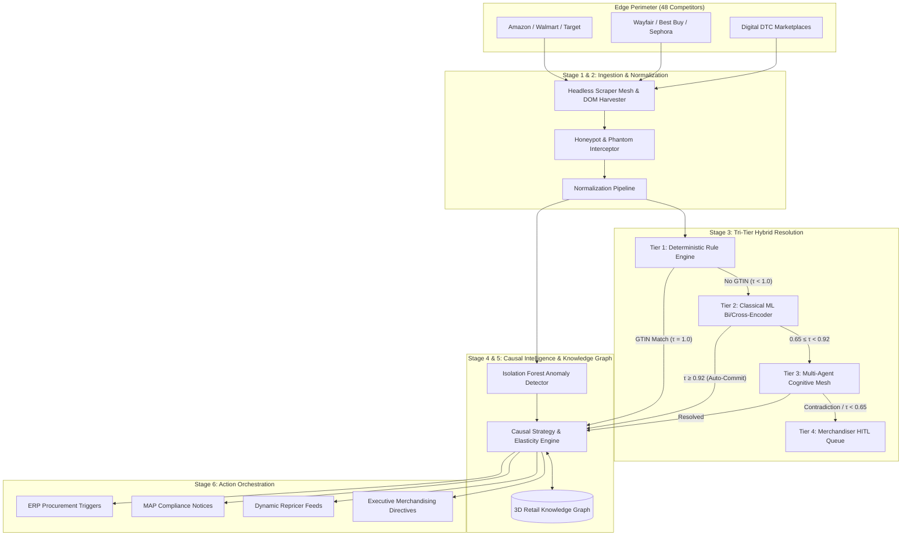
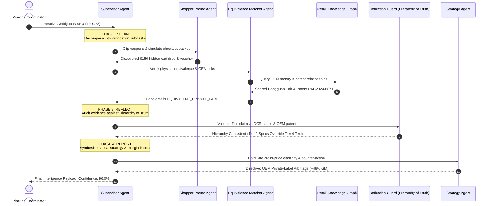
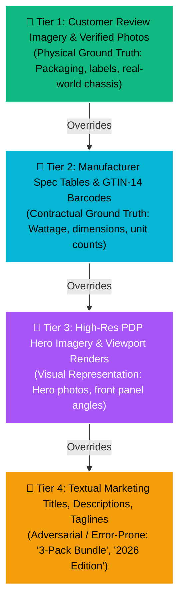
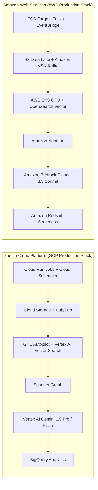

# Enterprise Architectural Document Record (ADR): Retail Competitor Intelligence Autonomous Hybrid Solution

---

## 1. System Context & Overview

The **AURORA Retail Competitor Intelligence Platform** is designed to eliminate margin erosion, detect competitor promotional evasion, and autonomously arbitrate SKU equivalence at enterprise scale (20,000+ data points, 48 retail competitors, 10 categories).



---

## 2. Tri-Tier Hybrid Decision Boundary Architecture

To balance **throughput (>150 SKUs/s)**, **sub-cent execution cost**, and **cognitive precision**, the resolution fabric implements a calibrated 3-tier hybrid routing topology:

```mermaid
flowchart TD
    Input([Incoming Scraped Competitor SKU]) --> Step1{GTIN / Barcode Parity?}
    
    %% Tier 1
    Step1 -- "Yes (Deterministic Match)" --> T1Commit[Tier 1: Immediate GTIN Auto-Commit<br/>Latency: < 0.5ms | Cost: $0.0000]
    Step1 -- "No Barcode / Obscured" --> Step2[Bi-Encoder Dense Retrieval<br/>HNSW Vector Search Top-K Candidates]
    
    %% Tier 2
    Step2 --> Step3[Cross-Encoder Fine-Grained Scoring<br/>Feature Compatibility Score τ]
    Step3 --> SplitDecision{Evaluate Score τ}
    
    SplitDecision -- "τ ≥ 0.92 (High Confidence)" --> T2Commit[Tier 2: Auto-Commit Direct Substitute<br/>Latency: 8.5ms | Cost: $0.0001]
    SplitDecision -- "0.65 ≤ τ < 0.92 (Ambiguous)" --> T3Escalate[Tier 3: Escalate to Multi-Agent Mesh<br/>Latency: 120ms | Cost: $0.0024]
    SplitDecision -- "τ < 0.40 (Definitive Mismatch)" --> Reject[Auto-Reject Mismatch]
    
    %% Tier 3
    T3Escalate --> Supervisor[Supervisor Agent: P-E-R-R Reasoning Loop]
    Supervisor --> T3Decision{Arbitration Verdict}
    T3Decision -- "Evidence Harmonized" --> T3Commit[Tier 3: Commit Cognitive Match]
    T3Decision -- "Multimodal Clash / Irresolvable" --> HITLQueue[Tier 4: Human Merchandiser HITL Queue]
    
    T1Commit & T2Commit & T3Commit --> Output([Downstream Causal Strategy Engine])
```

---

## 3. Multi-Agent Cognitive Mesh: Plan-Execute-Reflect-Report (P-E-R-R)

When ambiguity or promotional evasion is detected, the **Supervisor Agent** orchestrates sandboxed specialized sub-agents:



---

## 4. End-to-End 6-Stage Operational Lifecycle

```mermaid
stateDiagram-v2
    [*] --> Stage1_PerimeterDiscovery
    Stage1_PerimeterDiscovery --> Stage2_MultimodalIngestion: Discovered Sitemaps & PDPs
    Stage2_MultimodalIngestion --> Stage3_EntityResolution: Normalized JSON Payload
    Stage3_EntityResolution --> Stage4_SignalAnomalyDetection: Harmonized GPC & SKU Match
    Stage4_SignalAnomalyDetection --> Stage5_CausalSynthesis: Anomaly & Price Shift Signals
    Stage5_CausalSynthesis --> Stage6_ActionOrchestration: Causal Intent Hypothesis
    Stage6_ActionOrchestration --> [*]: Dispatched to Repricer & ERP
    
    state Stage1_PerimeterDiscovery {
        [*] --> DomainMapping
        DomainMapping --> TaxonomyCrawling
        TaxonomyCrawling --> [*]
    }
    
    state Stage2_MultimodalIngestion {
        [*] --> DOMHarvesting
        DOMHarvesting --> VisionOCRInspection
        VisionOCRInspection --> HoneypotQuarantine
        HoneypotQuarantine --> [*]
    }
    
    state Stage3_EntityResolution {
        [*] --> Tier1Rules
        Tier1Rules --> Tier2ClassicalML
        Tier2ClassicalML --> Tier3MultiAgent
        Tier3MultiAgent --> [*]
    }
    
    state Stage5_CausalSynthesis {
        [*] --> KnowledgeGraphTraversal
        KnowledgeGraphTraversal --> ElasticitySimulation
        ElasticitySimulation --> [*]
    }
```



---

## 5. 4-Tier Hierarchy of Truth Guardrail Engine

To prevent catastrophic hallucinations and deceptive packaging errors, the multi-agent mesh strictly enforces the **4-Tier Hierarchy of Truth**:



---

## 6. Cloud-Native Dual-Stack Architecture (GCP vs AWS)



---

## 7. Statistical Drift Radar Mathematical Model

The continuous telemetry fabric evaluates three mathematical drift dimensions across live ingestion batches:

1. **Population Stability Index (PSI)** for Ingestion Covariate Shift:
   $$\text{PSI} = \sum_{b=1}^{B} \left( P_b - Q_b \right) \times \ln\left(\frac{P_b}{Q_b}\right)$$
   - $\text{PSI} < 0.10$: Stable baseline
   - $0.10 \le \text{PSI} < 0.25$: Covariate warning (Drift alert logged)
   - $\text{PSI} \ge 0.25$: Critical covariate drift (Triggers automatic re-normalization)

2. **Wasserstein Distance (Earth Mover's Distance)** for Embedding Cluster Shift:
   $$W_1(u, v) = \int_{-\infty}^{\infty} |U(x) - V(x)| dx$$
   - Monitors spatial drift between baseline product vectors and newly ingested embeddings.

3. **Page-Hinkley Sequential Test** for Concept Decay:
   $$m_t = \sum_{i=1}^{t} (e_i - \bar{e} - \delta), \quad M_t = \min_{1 \le i \le t} m_i, \quad PH_t = m_t - M_t$$
   - Triggers model retraining when $PH_t > \lambda$ threshold (Default: $\lambda = 50.0$).
