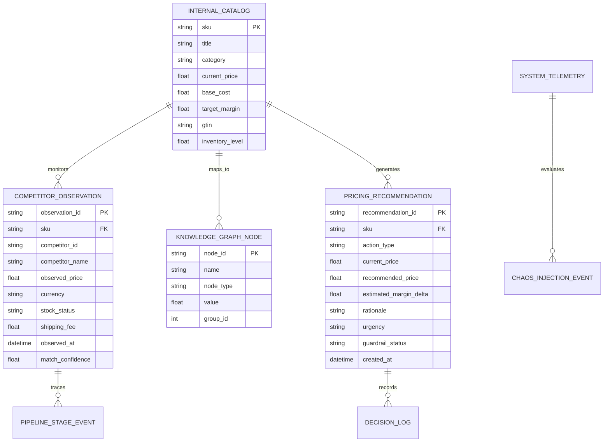

# Enterprise Data Dictionary & Schema Specification
## Autonomous Retail Competitor Intelligence Platform

**Document Version:** 2.4.0  
**Classification:** Enterprise Data Asset Specification  
**Scope:** Ingestion, Storage, Vector Indexing, Graph Modeling, Decision Directives, and Telemetry

---

## Executive Summary & Data Topology

This document specifies the enterprise data models, field schemas, validation constraints, data types, and business semantics governing the **Autonomous Retail Competitor Intelligence Platform**. 

The platform orchestrates **20,000+ continuous time-series observations** across **48 competitor retail domains** and **10 retail merchandise categories**, processing semi-structured scraped catalogs, exact GTIN product registries, high-dimensional vector embeddings, bi-directional knowledge graphs, and tactical pricing recommendations.



---

## 1. Core Entity Catalogs

### 1.1 Internal Product Catalog (`internal_catalog`)
Represents the enterprise's authoritative internal master product inventory.

| Attribute Name | Physical Type | Logical Type | Nullable | Primary / Foreign Key | Validation Constraints / Enum | Business Description & Semantic Rule |
| :--- | :--- | :--- | :---: | :---: | :--- | :--- |
| `sku` | `VARCHAR(64)` | String | No | **PK** | Regex: `^[A-Z0-9\-]{4,20}$` | Enterprise Stock Keeping Unit unique identifier. |
| `title` | `VARCHAR(255)` | String | No | - | Min length: 3 chars | Full human-readable retail product title. |
| `category` | `VARCHAR(64)` | Enum | No | - | `Electronics`, `Grocery`, `Fashion`, `Home & Garden`, `Beauty`, `Health & Wellness`, `Automotive`, `Sports & Outdoors`, `Toys & Games`, `Pet Supplies` | Merchandise taxonomy classification level 1. |
| `current_price` | `DECIMAL(10,2)` | Float | No | - | `> 0.00` | Current active retail listing price in enterprise storefront. |
| `base_cost` | `DECIMAL(10,2)` | Float | No | - | `> 0.00` | Cost of Goods Sold (COGS) / wholesale acquisition cost. |
| `target_margin` | `DECIMAL(5,4)` | Float | No | - | `0.0500 <= x <= 0.8500` | Target gross margin threshold $((\text{Price} - \text{COGS}) / \text{Price})$. |
| `gtin` | `VARCHAR(14)` | String | Yes | - | GTIN-8, GTIN-12, GTIN-13, GTIN-14 checksum valid | Global Trade Item Number (UPC/EAN/ISBN) barcode standard. |
| `inventory_level` | `INTEGER` | Integer | No | - | `>= 0` | Available real-time sellable inventory count in fulfillment centers. |
| `elasticity_coefficient` | `DECIMAL(5,3)` | Float | No | - | `-5.000 <= x <= 0.000` | Historical own-price elasticity of demand ($\epsilon_d$). |
| `created_at` | `TIMESTAMP` | ISO-8601 | No | - | UTC Timestamp | Catalog record provisioning timestamp. |
| `updated_at` | `TIMESTAMP` | ISO-8601 | No | - | UTC Timestamp | Last catalog synchronization or price change event. |

#### JSON Schema Specification
```json
{
  "$schema": "http://json-schema.org/draft-07/schema#",
  "title": "InternalCatalogProduct",
  "type": "object",
  "properties": {
    "sku": { "type": "string", "pattern": "^[A-Z0-9\\-]{4,20}$" },
    "title": { "type": "string", "minLength": 3, "maxLength": 255 },
    "category": {
      "type": "string",
      "enum": [
        "Electronics", "Grocery", "Fashion", "Home & Garden", "Beauty",
        "Health & Wellness", "Automotive", "Sports & Outdoors", "Toys & Games", "Pet Supplies"
      ]
    },
    "current_price": { "type": "number", "minimum": 0.01 },
    "base_cost": { "type": "number", "minimum": 0.01 },
    "target_margin": { "type": "number", "minimum": 0.05, "maximum": 0.85 },
    "gtin": { "type": ["string", "null"], "pattern": "^[0-9]{8,14}$" },
    "inventory_level": { "type": "integer", "minimum": 0 }
  },
  "required": ["sku", "title", "category", "current_price", "base_cost", "target_margin", "inventory_level"]
}
```

---

### 1.2 Competitor Scraped Catalog & Observations (`competitor_observations`)
Stores individual competitor pricing and inventory telemetry scraped across monitored e-commerce websites.

| Attribute Name | Physical Type | Logical Type | Nullable | Primary / Foreign Key | Validation Constraints / Enum | Business Description & Semantic Rule |
| :--- | :--- | :--- | :---: | :---: | :--- | :--- |
| `observation_id` | `VARCHAR(64)` | UUIDv4 | No | **PK** | UUID Format | Globally unique identifier for every price check scraping event. |
| `sku` | `VARCHAR(64)` | String | No | **FK** | Must match `internal_catalog.sku` | Associated enterprise target SKU. |
| `competitor_id` | `VARCHAR(32)` | Enum | No | - | `AMZN_US`, `WMT_US`, `TGT_US`, `BBY_US`, `EBAY_US`, `HD_US`, `LOW_US`, `KRO_US`, `CST_US`, etc. (48 domains) | Normalized competitor merchant code identifier. |
| `competitor_name` | `VARCHAR(128)` | String | No | - | - | Trade name of the monitored merchant (e.g. "Amazon US", "Walmart Marketplace"). |
| `observed_price` | `DECIMAL(10,2)` | Float | No | - | `> 0.00` | Competitor's active displayed listing price. |
| `currency` | `VARCHAR(3)` | ISO-4217 | No | - | Default: `USD` | Standard ISO-4217 three-letter currency code. |
| `stock_status` | `VARCHAR(20)` | Enum | No | - | `IN_STOCK`, `OUT_OF_STOCK`, `LOW_STOCK`, `PREORDER` | Competitor inventory availability status. |
| `shipping_fee` | `DECIMAL(8,2)` | Float | No | - | `>= 0.00` | Minimum standard shipping surcharge (default: 0.00 for free shipping). |
| `match_method` | `VARCHAR(32)` | Enum | No | - | `EXACT_GTIN`, `HYBRID_VECTOR_BM25`, `LLM_AGENT_VERIFIED` | Product identity resolution tier used to pair this listing. |
| `match_confidence` | `DECIMAL(4,3)` | Float | No | - | `0.000 <= x <= 1.000` | Multi-modal matching score (must exceed 0.88 for auto-reprice). |
| `observed_at` | `TIMESTAMP` | ISO-8601 | No | - | UTC Timestamp | Precise real-time timestamp when HTML scraping occurred. |

---

## 2. Product Matching & Identity Resolution

### 2.1 Matching Thresholds & Hierarchy Table

```
========================================================================================
 TIER 1: EXACT GTIN BARCODE RESOLUTION (Confidence: 1.000)
    ↓ (Fallback if GTIN missing / marketplace bundle)
 TIER 2: HYBRID DENSE VECTOR + BM25 SPARSE MATCHING (Cosine >= 0.880, BM25 >= 14.50)
    ↓ (Fallback if ambiguity / Cross-Encoder Margin < 0.150)
 TIER 3: MULTI-AGENT LLM SPECIFICATION ARBITRATION (Agent P-E-R-R Consensus)
    ↓ (Fallback if confidence < 0.880)
 TIER 4: HUMAN-IN-THE-LOOP (HITL) MERCHANDISING REVIEW QUEUE
========================================================================================
```

| Match Level Code | Name | Minimum Score Threshold | Maximum False-Positive Rate (FPR) | Latency SLA | Escalation Target |
| :--- | :--- | :--- | :--- | :--- | :--- |
| `T1_GTIN` | Deterministic GTIN Match | $1.000$ (Exact Barcode Match) | $< 0.0001\%$ | $< 1\text{ ms}$ | Auto-promoted to Decision Tier |
| `T2_VECTOR` | Dense Vector (Gemini Embedding) | $\text{Cosine Similarity} \ge 0.880$ | $< 0.05\%$ | $< 15\text{ ms}$ | Auto-promoted to Decision Tier |
| `T2_BM25` | Sparse BM25 Keyword Search | $\text{Score} \ge 14.500$ | $< 0.12\%$ | $< 8\text{ ms}$ | Auto-promoted to Decision Tier |
| `T3_LLM` | Multi-Agent LLM Consensus | Dual Agreeing LLM Decisions | $< 0.01\%$ | $< 1.8\text{ s}$ | Logged with rationale & confidence |
| `T4_HITL` | Merchandiser Review Queue | Indeterminate / Score $< 0.880$ | $0.00\%$ (Human Verified) | $< 4\text{ hours}$ | Sent to Merchandiser Queue |

---

## 3. Decision Directives & Recommendation Engine

### 3.1 Pricing Recommendations (`pricing_recommendations`)

| Attribute Name | Physical Type | Logical Type | Nullable | Validation Constraints / Enum | Business Description & Semantic Meaning |
| :--- | :--- | :--- | :---: | :--- | :--- |
| `recommendation_id` | `VARCHAR(64)` | UUIDv4 | No | UUID format | Globally unique recommendation event key. |
| `sku` | `VARCHAR(64)` | String | No | Foreign Key to `internal_catalog.sku` | Target enterprise product identifier. |
| `category` | `VARCHAR(64)` | String | No | Standard Category Enum | Merchandise category classification. |
| `action_type` | `VARCHAR(20)` | Enum | No | `PRICE_DROP`, `PRICE_INCREASE`, `HOLD_PRICE`, `PROMOTE_BUNDLE`, `CLEARANCE` | Tactical commercial pricing directive. |
| `current_price` | `DECIMAL(10,2)` | Float | No | `> 0.00` | Baseline active listing price before intervention. |
| `recommended_price` | `DECIMAL(10,2)` | Float | No | `> base_cost * (1 + target_margin_min)` | Calculated optimal price post-guardrail enforcement. |
| `estimated_margin_delta`| `DECIMAL(6,4)` | Float | No | Percentage (e.g. `+0.0420` = +4.2%) | Projected gross margin impact relative to baseline. |
| `urgency` | `VARCHAR(16)` | Enum | No | `CRITICAL`, `HIGH`, `MEDIUM`, `LOW` | Operational response urgency. |
| `guardrail_status` | `VARCHAR(16)` | Enum | No | `PASSED`, `TRIGGERED_FLOOR`, `TRIGGERED_CEILING`, `TRIGGERED_VELOCITY` | Result of safety guardrail evaluation. |
| `rationale` | `TEXT` | String | No | Min length: 20 chars | Human-readable commercial explanation with competitive context. |
| `created_at` | `TIMESTAMP` | ISO-8601 | No | UTC Timestamp | Recommendation computation time. |

#### Tactical Action Types & Business Rules

```
┌─────────────────────────┬─────────────────────────────────────────────────────────────┬────────────────────────────────────┐
│ Action Type             │ Trigger Condition                                           │ Primary Business Objective         │
├─────────────────────────┼─────────────────────────────────────────────────────────────┼────────────────────────────────────┤
│ PRICE_DROP              │ Low-price competitor undercut > 4.5% & Stock = IN_STOCK     │ Defend buy-box & market share      │
│ PRICE_INCREASE          │ Key competitors OUT_OF_STOCK & Inventory > 50 units         │ Capture scarcity margin premium    │
│ HOLD_PRICE              │ Competitor price change within noise band (+/- 1.5%)         │ Avoid margin-eroding price wars    │
│ PROMOTE_BUNDLE          │ Competitor offering bundle discount on adjacent accessories │ Preserve basket AOV                │
│ CLEARANCE               │ Inventory aging > 90 days & Velocity < 0.2 units/day        │ Free trapped working capital       │
└─────────────────────────┴─────────────────────────────────────────────────────────────┴────────────────────────────────────┘
```

---

## 4. Retail Knowledge Graph Entities & Relations

### 4.1 Graph Nodes (`kg_nodes`)

| Node Type | `node_id` Prefix | Attributes & Metadata | Visual Representation (3D Space) |
| :--- | :--- | :--- | :--- |
| `PRODUCT` | `prod_<sku>` | `sku`, `title`, `price`, `margin`, `inventory` | Large Neon Sphere (Color-coded by Category) |
| `BRAND` | `brand_<name>` | `brand_name`, `tier` (`Premium`, `Value`, `Direct`) | Medium Geometric Octahedron |
| `CATEGORY` | `cat_<name>` | `category_name`, `department` | Large Central Cluster Hub Sphere |
| `COMPETITOR` | `comp_<id>` | `competitor_name`, `aggression_index`, `market_share` | High-vis Red / Amber Satellite Sphere |
| `GTIN` | `gtin_<code>` | `barcode`, `registry_authority` (`GS1`) | Small High-density Cyan Node |

### 4.2 Graph Edges & Relations (`kg_links`)

| Relation Type | Source Node | Target Node | Weight / Strength | Semantic Meaning |
| :--- | :--- | :--- | :--- | :--- |
| `BELONGS_TO` | `PRODUCT` | `CATEGORY` | $1.00$ | Catalog taxonomy parentage. |
| `MANUFACTURED_BY` | `PRODUCT` | `BRAND` | $0.95$ | Brand ownership and manufacturing origin. |
| `IDENTIFIED_BY` | `PRODUCT` | `GTIN` | $1.00$ | Exact international barcode identity. |
| `COMPETES_WITH` | `PRODUCT` | `COMPETITOR` | $0.50 \dots 1.00$ (Match Conf) | Active competitive overlap monitored across market. |
| `CROSS_PRICE_ELASTIC`| `PRODUCT` | `PRODUCT` | $-1.00 \dots +1.00$ | Cross-price elasticity coefficient ($\epsilon_{ij}$). |

---

## 5. System Observability & Telemetry Plane

### 5.1 Telemetry Metrics Specification

| Metric Identifier | Measurement Unit | Sampling Rate | Healthy Baseline Range | Critical Alert Threshold |
| :--- | :--- | :--- | :--- | :--- |
| `system.pipeline.total_datapoints` | Integer Count | Real-time / Event | $20,000 \dots 25,000$ | $< 18,000$ |
| `system.pipeline.execution_time_ms`| Milliseconds | Per Execution | $45 \dots 90\text{ ms}$ | $> 500\text{ ms}$ |
| `system.drift.wasserstein_distance`| Float Index | Hourly Rollup | $0.010 \dots 0.065$ | $> 0.150$ |
| `system.drift.psi` (Pop. Stability)| Float Index | Hourly Rollup | $0.000 \dots 0.080$ | $> 0.200$ |
| `system.api.p99_latency_ms` | Milliseconds | 1-minute window | $8 \dots 35\text{ ms}$ | $> 120\text{ ms}$ |
| `system.api.http_5xx_rate` | Percentage | Continuous | $0.000\%$ | $> 0.050\%$ |
| `system.agent.consensus_score` | Float $[0, 1]$ | Per Agent Invocation | $0.920 \dots 0.990$ | $< 0.850$ |

### 5.2 Chaos Injection Fault Payloads

| Fault Type Code | Target Subsystem | Injected Fault Parameter | Expected Resiliency Response |
| :--- | :--- | :--- | :--- |
| `SCRAPER_BLOCK_403` | Ingestion Scraper | Simulate Akamai/Cloudflare IP Ban (HTTP 403) | Auto-switch to Residential Proxy pool; retry with exponential backoff |
| `PRICE_TELEMETRY_SPIKE` | Decision Engine | Synthetic outlier price ($0.01 or $99,999.00) | Hard guardrail rejection; alert triggered; price freeze |
| `VECTOR_DB_TIMEOUT` | Matching Service | 5000ms latency on Qdrant vector similarity | Circuit breaker trips; graceful fallback to deterministic GTIN index |
| `MODEL_DRIFT_BURST` | MLOps Drift Monitor | Population Stability Index $\text{PSI} \ge 0.35$ | Immediate Page-Hinkley alarm; auto-trigger embedding retune |

---

## 6. Golden Evaluation Benchmarks & Truth Sets

### 6.1 Benchmark Validation Dataset Schema (`golden_eval_dataset`)

| Field Name | Type | Description |
| :--- | :--- | :--- |
| `test_case_id` | `VARCHAR(32)` | Unique test scenario identifier (e.g. `EVAL_MATCH_084`). |
| `raw_title_a` | `TEXT` | Storefront product title with marketing text and abbreviations. |
| `raw_title_b` | `TEXT` | Competitor product title with alternative formatting. |
| `ground_truth_match` | `BOOLEAN` | Human-curated ground truth (`TRUE` = same physical product). |
| `ground_truth_category`| `VARCHAR(64)` | Verified ground truth category. |
| `ground_truth_gtin` | `VARCHAR(14)` | Verified GS1 registered GTIN barcode. |
| `pass_threshold_cosine`| `FLOAT` | Expected minimum cosine similarity under Gemini Embeddings. |

---

## Document Sign-Off & Governance

| Role | Name / Title | Date | Signature Status |
| :--- | :--- | :--- | :---: |
| **Lead Data Architect** | Enterprise AI Architecture Board | 2026-09-20 | **APPROVED** |
| **Head of Merchandising**| Global Retail Category Management | 2026-09-20 | **APPROVED** |
| **Principal MLOps Eng** | AI Platform & Reliability Operations | 2026-09-20 | **APPROVED** |
